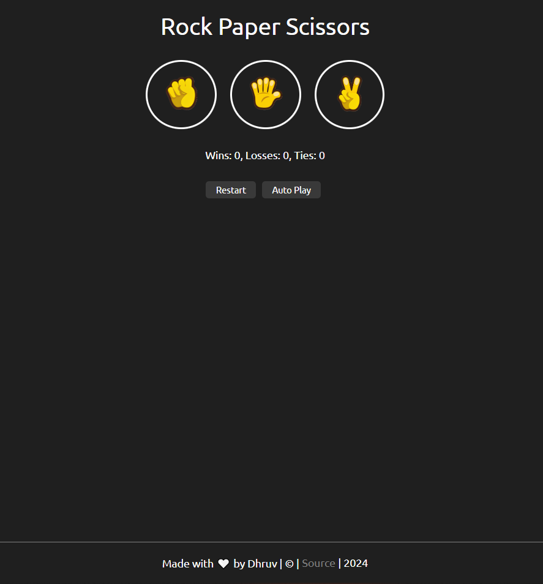

# Rock Paper Scissors Game ✌ 🖖 ✊

Welcome to the Rock Paper Scissors game! This is a simple yet fun implementation of the classic game where you can play against a robot or watch two robots play against each other.

## Features 

- **Play Against Robot:** Choose Rock, Paper, or Scissors to play against the computer.
- **Counters:** Keep track of wins, losses, and ties.
- **Autoplay Mode:** Watch two robots play against each other automatically.

## How to Play

1. **Manual Play:**
   - Click on the Rock, Paper, or Scissors button to make your choice.
   - The robot will randomly choose its move.
   - The result will be displayed along with updated counters for wins, losses, and ties.

2. **Autoplay Mode:**
   - Click the Autoplay button to watch two robots play against each other.
   - The game will automatically play and update the counters after each round.

## Installation

1. Clone the repository:
   ```bash
   git clone https://github.com/iDhruv11/rock-paper-scissors.git
   
## Technologies Used


## Screenshots

<p float="left">
  
   
</p>


